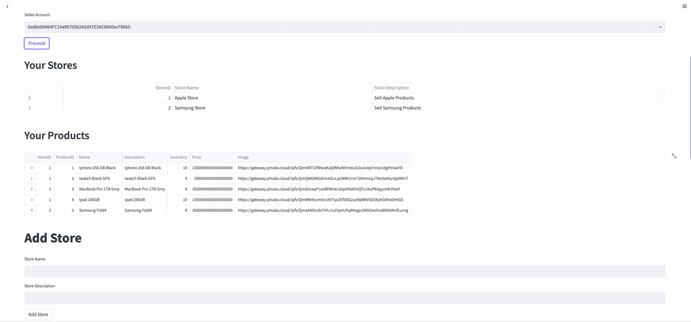

# EthBay

## OverView

EthBay is an ecommerce platform based on blockchain. All transactions are based on ethereum.

At the core of the application is a Solidity Contract that defines various structs and defines the operations that can be invoked by various actors.

Streamlit tier allows different actors to interact with the contract via UI.

## Actors
There are 3 differenct actors : 
* **Owner** - The deployer of the contract is assigned as an owner of the contract. Everytime buyer buys a products, contract balance is incremented by the commision amount. Owner can perform below functions:
    * Owner can add sellers to the contract
    * Owner can withdraw Eth from the contract to his address
    * Owner can view all the stores & products registered on EthBay.
    * Change contract commission.

* **Seller** - Seller can perform below functions:
    * View all stores and products registered to seller
    * Add new products to stores
    * Update price & inventory of the product
    * Check his balance
    * Withdraw his balance

Seller can have multiple stores and each store will have multiple products.

* **Buyer** - Buyer can perform below functions:
    * View all products registered on EthBay
    * Buy a product

Everytime buyer buys a products, contract calculates the contract commision based on the currenct commission value. Rest amount is added to Seller's balance.

## User Interface

User Interface to interact with the contract is implemented in Streamlit.

* Owner View

* Seller View

* Buyer View

## Installation
* Ganache - The contract will be deployed on Ganache. PLease install ganache on machine. https://trufflesuite.com/ganache/
* Solidity - Use Remix IDE to deploy the EthBay.sol to Ganache - https://remix.ethereum.org/
* Install Streamlit to run UI application to interact with - https://docs.streamlit.io/library/get-started/installation
* Pinata - Signup to pinata and generate key. - https://app.pinata.cloud/keys

## Contract
EthBay contract is located in Contracts folder. Open the contract in Remix IDE - https://remix.ethereum.org/
and deploy it on local Ganache Setup

## Run Application

Follow below steps to run the application

* Update .env file 

        WEB3_PROVIDER_URI= Ganache URL
        SMART_CONTRACT_ADDRESS= Deployed Contract Address
        PINATA_KEY = JWT of the generated PINATA key.

* Copy the contract ABI from Remix and paste it to Contracts/Compiled/ethbay_abi.json

* Run Streamlit

        cd /EthBay/UI
        streamlit run ethbay.py
